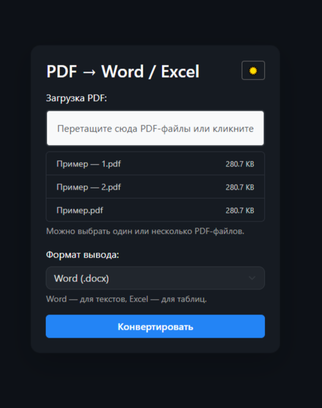
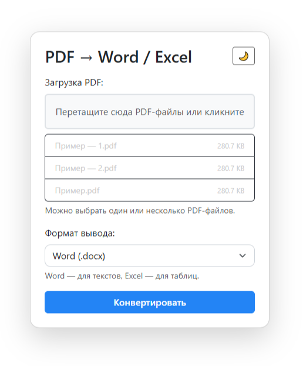

🧩 PDF Converter — Простой и Удобный Конвертер PDF → Word / Excel

Web-приложение для конвертации PDF-файлов в Word (.docx) и Excel (.xlsx) с удобным интерфейсом и возможностью перетаскивания файлов. Всё работает прямо в браузере — без регистрации и без установки дополнительных программ.

🚀 Возможности
🔄 Поддержка конвертации нескольких PDF-файлов одновременно
📁 Drag & Drop интерфейс
🧾 Поддержка форматов: DOCX (Word) и XLSX (Excel)
🗂 Автоматическая упаковка в ZIP-архив
🌙 Темная/светлая тема
📜 Логирование действий (с ротацией)
🐳 Готовый Docker-образ

🔧 Использование (Docker)
docker run -d -p 8080:8080 yourname/pdf-converter
Затем открой в браузере:
📍 http://localhost:8080

⚙️ Docker Compose

version: '3.8'
services:
  pdf-converter:
    image: yourname/pdf-converter:latest
    ports:
      - "8080:8080"
    restart: unless-stopped

🗂 Примеры использования
👨‍💻 Личный конвертер документов
📊 Извлечение таблиц из сканов и отчетов

🛠 Технологии
Flask (Blueprint)
pdf2docx
camelot-py
gunicorn
Bootstrap 5.3
Docker

📜 Лицензия
MIT — используй свободно
